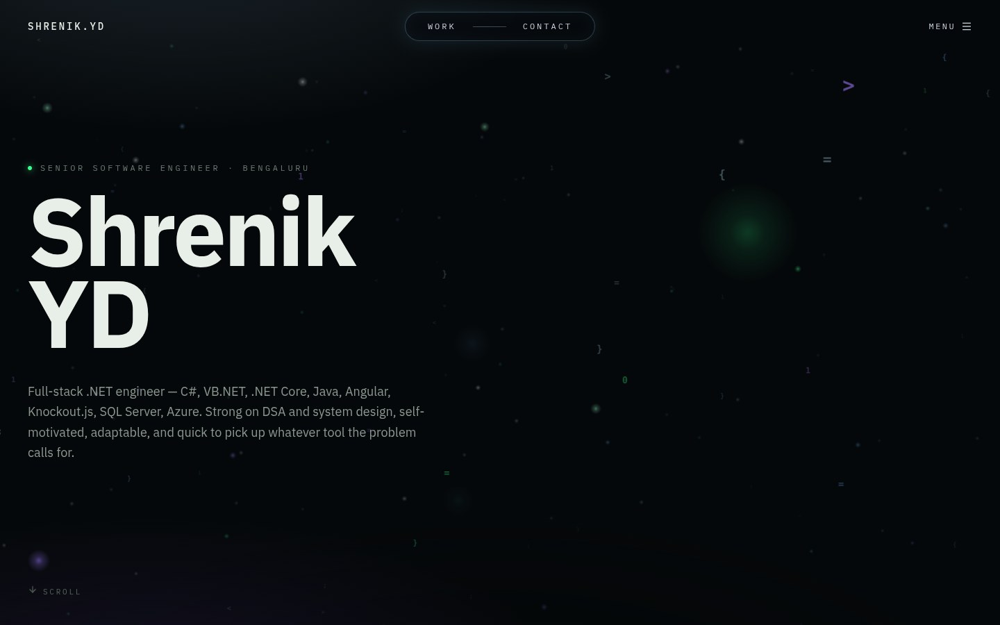
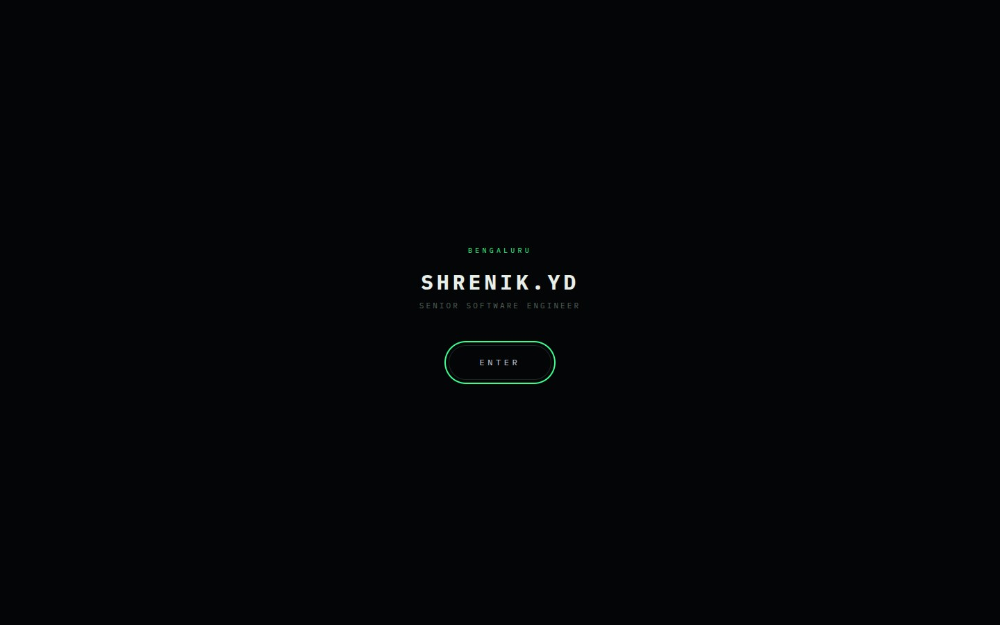
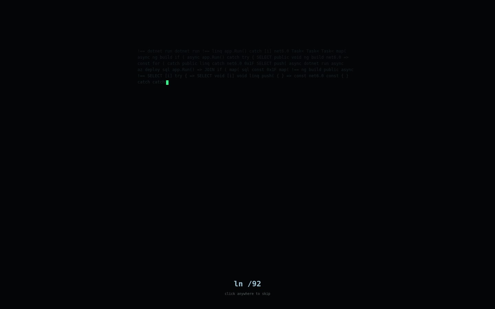
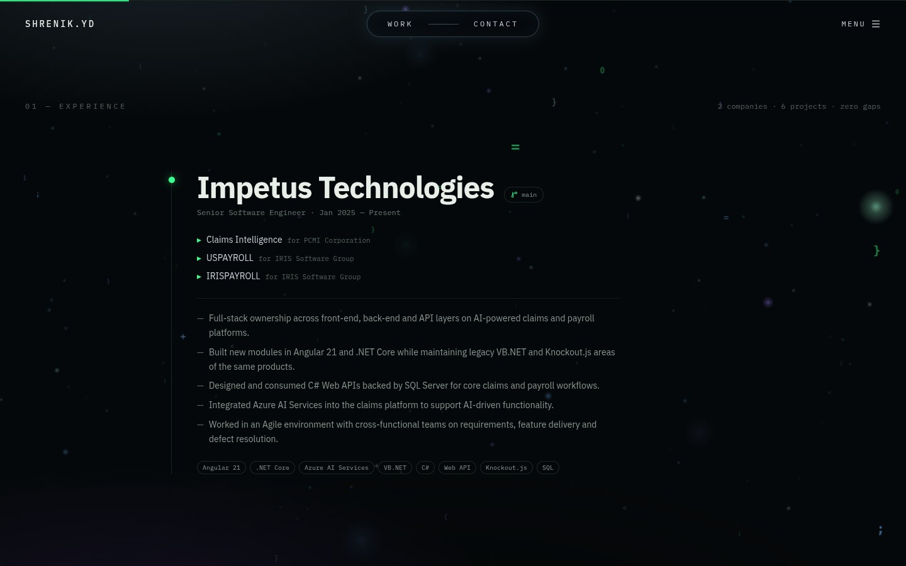
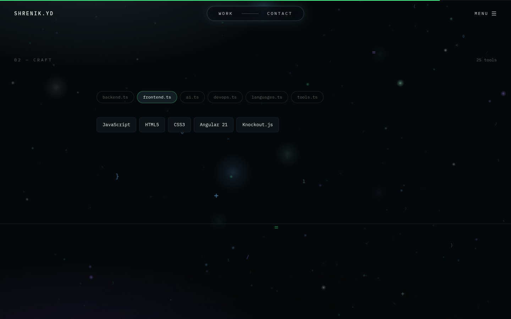
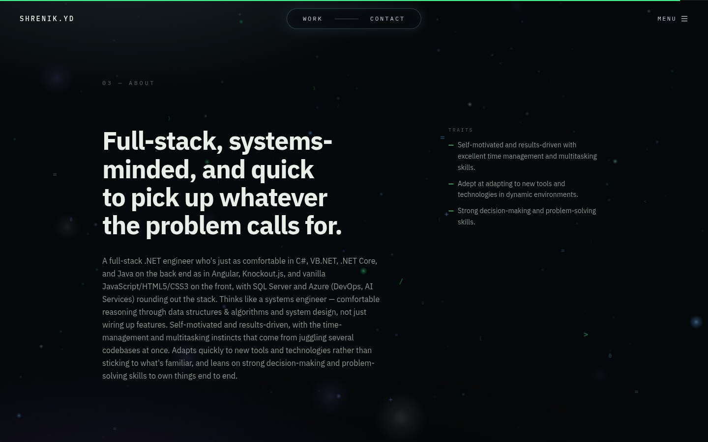
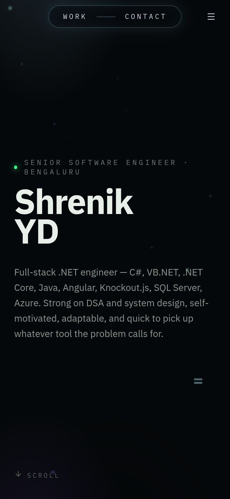
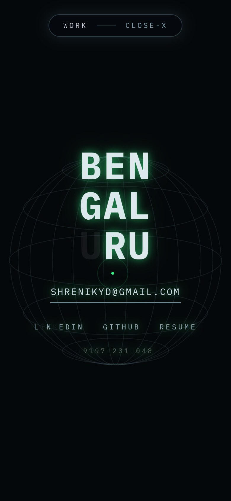
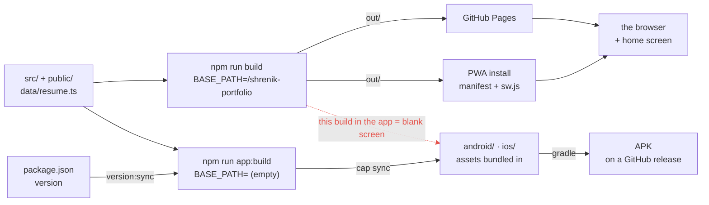
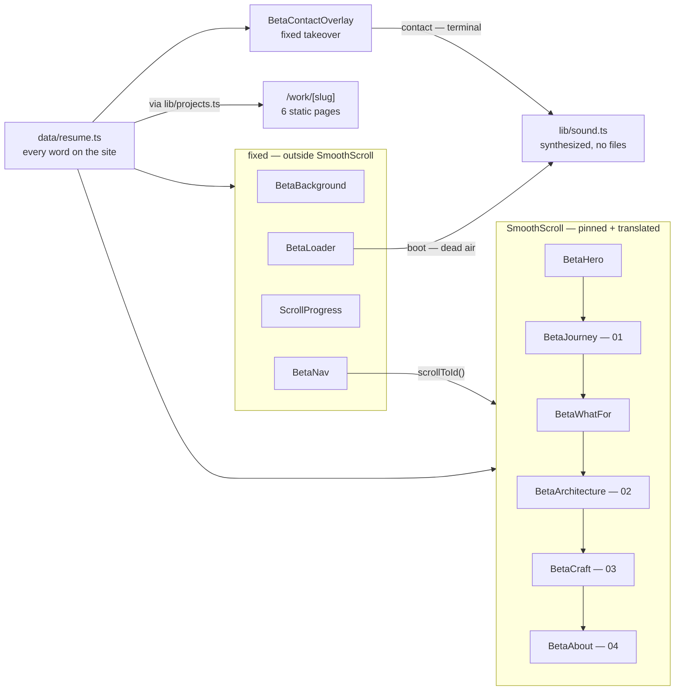

# Shrenik YD — Portfolio

A cinematic, scroll-driven portfolio for a full-stack .NET engineer, built as a
static site and shipped three ways: on the web, as an installable PWA, and as a
real Android and iOS app.

**[Open the site →](https://shrenikyd.github.io/shrenik-portfolio/)** &nbsp;·&nbsp;
**[Download the Android app →](https://github.com/SHRENIKYD/shrenik-portfolio/releases/latest)**



---

## The experience

The site opens on a gate, runs a loader, and then behaves less like a document
than like a place you move through.

<table>
  <tr>
    <td width="50%"></td>
    <td width="50%"></td>
  </tr>
  <tr>
    <td><b>The gate.</b> One click, which exists for a technical reason: browsers
    refuse to play audio before a visitor interacts with the page, and the loader
    runs before any interaction has happened.</td>
    <td><b>The loader.</b> A terminal types by itself, accelerating exponentially
    until the text is a blur, then collapses to a point and bursts back out as
    radial rays of glyphs.</td>
  </tr>
</table>

<table>
  <tr>
    <td width="50%"></td>
    <td width="50%"></td>
  </tr>
  <tr>
    <td><b>Experience</b> as a git-style timeline — roles, the projects each one
    produced, and education as a root node.</td>
    <td><b>Craft</b> — skills as category tabs that advance on their own until you
    take over.</td>
  </tr>
  <tr>
    <td></td>
    <td></td>
  </tr>
  <tr>
    <td><b>Contact</b> is a full-screen takeover: a dead neon sign getting its
    power back, character by character, with a few tubes that stay faulty
    forever.</td>
    <td><b>About</b>, closing on the numbers that matter.</td>
  </tr>
</table>

### On a phone

<p>
  
  
  
</p>

---

## What is actually going on under it

- **A WebGL underwater scene** (three.js) behind everything — particle clouds,
  bokeh, and drifting "marine snow" of code glyphs. The camera descends as you
  scroll. Pauses when the tab is hidden, and renders a single static frame under
  `prefers-reduced-motion`.
- **Weighted scrolling.** The page body carries the content's height, the content
  is pinned and translated, and that translation *eases* toward the real scroll
  position instead of matching it. Native scrolling still drives everything, so
  the wheel, keyboard and anchors behave normally.
- **A synthesized score.** No audio files anywhere — every sound is oscillators
  and filtered noise through a convolution reverb. The loader gets *Dead air*: a
  vast, almost inaudible room whose removal at the burst is the effect. The
  contact screen gets *Terminal*: a relay click per tube flicker, a keycap thock
  as each character locks. Both are driven off the same per-frame state as the
  visuals, so the audio cannot drift out of sync.
- **Offline from first run.** A service worker caches the shell; the native apps
  bundle the assets outright.

Everything respects `prefers-reduced-motion`, which turns off the loader, the
ignition, the eased scrolling and all sound.

---

## Architecture

Two views of the same repository: what gets built and where it goes, and what
renders on the page and what feeds it.

### 1 · Build and release

One repository, **two build modes that differ by a single environment variable**,
and three places the result ends up. The distinction is invisible until it bites:
the Pages build stamps a basePath onto every asset URL, and that path does not
exist inside the app's webview.



**The single environment variable is the whole story.** Both branches run the
same Next export; the Pages build prefixes every asset with
`/shrenik-portfolio`, which is correct for a project page and fatal inside a
webview, where that path does not exist. The dashed edge is the mistake — the
Pages build copied into `android/`, which installs fine and opens to a blank
screen. `version:sync` writes one version into the Gradle manifest, the Xcode
project and the service worker's cache name, so the number cannot drift between
surfaces.

### 2 · What renders, and what feeds it

The page splits into **four fixed layers and one scrolled column**, and that
split is load-bearing rather than cosmetic. `SmoothScroll` pins its children and
moves them with a transform, so anything that must stay put — background, nav,
overlays — has to live outside it.



**The `SmoothScroll` box is why three separate bugs happened.** It pins its
children and moves them with a transform, so inside it an element's viewport rect
no longer tracks document scroll:

- `scrollIntoView` computes zero and every anchor on the site silently dies —
  hence `scrollToId()`, which reads the eased offset instead. A smoke test now
  fails if that regresses.
- `position: sticky` has no scrolling ancestor to attach to, which is why
  `BetaArchitecture` pins itself from viewport rects.
- Anything that must stay put lives outside the box.

Both diagrams describe load-bearing constraints, not preferences. Changing either
without knowing that is how the blank app and the dead anchors happened.

---

## Routes

Every route is statically generated — there is no server.

| Route | What it is |
|---|---|
| `/` | The portfolio |
| `/beta` | Alias of `/`, kept so existing links keep working |
| `/work/<slug>` | One page per project (6), each with its own title, description, canonical URL and `CreativeWork` JSON-LD |
| `404` | Dark not-found page with a way back |

Project pages exist because the portfolio was a single URL: nobody could share a
specific piece of work, and search engines had exactly one document to index.
They are also reachable without sitting through the entry sequence.

## Project structure

```
src/
  app/
    page.tsx            the portfolio
    beta/page.tsx       alias of /
    work/[slug]/        one static page per project
    layout.tsx          metadata, metadataBase, OG tags
    manifest.ts         PWA manifest
    not-found.tsx       404 · error.tsx · global-error.tsx
  components/beta/
    BetaSite.tsx        composes everything below
    SmoothScroll.tsx    the pinned/translated scroller + scrollToId()
    BetaBackground.tsx  three.js scene, with a no-WebGL fallback
    BetaLoader.tsx      entry gate + runaway-terminal loader
    Beta{Hero,Journey,WhatFor,Architecture,Craft,About}.tsx
    BetaContactOverlay.tsx  the neon-sign takeover
    BetaNav.tsx · ScrollProgress.tsx · VersionBadge.tsx
  data/resume.ts        every word on the site
  lib/
    sound.ts            the whole score, synthesized
    projects.ts         flattened projects + slugs
    site.ts · basePath.ts
tests/                  Playwright specs
scripts/sync-version.mjs
android/  ios/          real native projects (Capacitor)
```

---

## Running it

```bash
npm install
npm run dev            # http://localhost:3000
```

Other scripts:

| Command | What it does |
|---|---|
| `npm run build` | Static export to `out/` |
| `npm run app:build` | Same, but with no basePath — for the native apps |
| `npm run app:sync` | Sync version, build, and copy into `android/` and `ios/` |
| `npm run app:android` | The above, then open Android Studio |
| `npm run app:ios` | The above, then open Xcode |
| `npm run version:sync` | Push `package.json`'s version into every platform |
| `npm run test:e2e` | Playwright smoke tests against the built export |
| `npm run test:e2e:ui` | The same, in Playwright's UI mode |
| `npm run lint` | ESLint |

## Editing the content

All of it lives in [`src/data/resume.ts`](src/data/resume.ts) — profile, jobs and
their projects, skills, education, stats. Change the data and the UI follows; no
component edits needed.

The downloadable résumé is [`public/Shrenik_YD_Resume.pdf`](public/Shrenik_YD_Resume.pdf).
Keep the filename or update `resumeFile` in `resume.ts`.

## Versioning

`package.json` is the single source of truth. `npm run version:sync` writes that
version into the Android manifest, the Xcode project and the service worker's
cache name, and the site displays it in the menu — so every surface agrees.
Android's `versionCode` is packed from the semver as
`major * 10000 + minor * 100 + patch`, because it must be an integer that never
goes backwards.

## The mobile apps

`android/` and `ios/` are real native projects wrapping the exported site with
Capacitor, with the web assets bundled into the binary.

The quickest way to an installable APK is the **Build Android APK** workflow in
the Actions tab — it builds on GitHub's runners and attaches the result to a
release, so nobody needs Android Studio locally. See
**[MOBILE.md](MOBILE.md)** for local builds, signing, and the App Store caveat.

## Tests

```bash
npm run build && npm run test:e2e
```

Playwright runs against the **built static export**, not a dev server, because
several of the things worth guarding — the service worker, the social card, the
basePath — only exist in a build. Three projects:

| Project | Runs |
|---|---|
| `chromium` | The full smoke suite, desktop viewport |
| `no-webgl` | The site launched with `--disable-3d-apis` |
| `mobile` | The gate and nav on a Pixel 7 viewport |

**Every test here maps to a regression that once shipped to production
undetected** — that is the bar for adding one:

- Every section anchor resolves, and the menu and WORK pill actually scroll to
  their sections (the eased scroller broke all of them).
- The page renders with no WebGL context (it once rendered a blank error page).
- `og:image` is absolute and resolves (relative OG URLs mean blank link
  previews).
- The manifest's icons all resolve, and a service worker ships.
- The contact takeover opens, ignites and closes.
- The architecture deck advances through its layers as its track is scrolled.
- Each `/work/<slug>` page exists with a distinct title, and a work card links
  through to it.
- The 404 is dark and offers a way back.

## Continuous integration

| Workflow | Trigger | What it does |
|---|---|---|
| [`smoke.yml`](.github/workflows/smoke.yml) | Push to `main`, PRs, manual | Builds the export and runs the Playwright suite; uploads the report on failure |
| [`deploy.yml`](.github/workflows/deploy.yml) | Push to `main` | Builds and publishes to GitHub Pages |
| [`android.yml`](.github/workflows/android.yml) | Manual | Builds the APK on GitHub's runners and attaches it to a release |

Actions are pinned to commit SHAs rather than tags.

## Deployment

[`.github/workflows/deploy.yml`](.github/workflows/deploy.yml) builds the static
export and publishes it to GitHub Pages on every push to `main`. Pages must be
set to **Settings → Pages → Source → GitHub Actions**.

The build sets `NEXT_PUBLIC_BASE_PATH` to `/<repo-name>`, which project pages
need. If this repo were named `<username>.github.io`, that line should be
removed — user pages are served from the domain root.

## Built with

Next.js 16 (App Router, static export) · TypeScript · Tailwind CSS v4 ·
Framer Motion · three.js · Web Audio API · Capacitor
